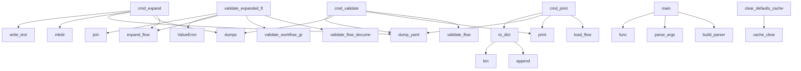

# System Architecture Analysis
<!-- generated in 0.00s -->

## Overview

- **Project**: /home/tom/github/tellmesh/uri2flow
- **Primary Language**: yaml
- **Languages**: yaml: 15, python: 10, shell: 3, toml: 1, json: 1
- **Analysis Mode**: static
- **Total Functions**: 31
- **Total Classes**: 4
- **Modules**: 30
- **Entry Points**: 7

## Architecture by Module

### uri2flow.resolver
- **Functions**: 10
- **Classes**: 1
- **File**: `resolver.py`

### uri2flow.cli
- **Functions**: 5
- **File**: `cli.py`

### uri2flow.expander
- **Functions**: 4
- **File**: `expander.py`

### uri2flow.parser
- **Functions**: 4
- **Classes**: 1
- **File**: `parser.py`

### uri2flow.utils
- **Functions**: 4
- **File**: `utils.py`

### uri2flow.validator
- **Functions**: 3
- **File**: `validator.py`

### uri2flow.models
- **Functions**: 1
- **Classes**: 2
- **File**: `models.py`

## Key Entry Points

Main execution flows into the system:

### uri2flow.cli.cmd_expand
- **Calls**: uri2flow.expander.expand_flow, json.dumps, uri2flow.expander.dump_yaml, None.parent.mkdir, None.write_text, print, Path, Path

### uri2flow.validator.validate_expanded_flow
> Validate compact flow and its expanded workflow graph.
- **Calls**: uri2flow.validator.validate_flow_document, validate_workflow_graph, uri2flow.expander.expand_flow, ValueError, None.join

### uri2flow.cli.cmd_validate
- **Calls**: uri2flow.validator.validate_flow, print, json.dumps, uri2flow.expander.dump_yaml

### uri2flow.cli.cmd_print
- **Calls**: uri2flow.parser.load_flow, print, uri2flow.expander.dump_yaml, flow.to_dict

### uri2flow.cli.main
- **Calls**: uri2flow.cli.build_parser, parser.parse_args, args.func

### uri2flow.models.FlowDocument.to_dict
- **Calls**: None.append, len

### uri2flow.resolver.clear_defaults_cache
- **Calls**: _load_flow_defaults_config.cache_clear

## Process Flows

Key execution flows identified:

### Flow 1: cmd_expand
```
cmd_expand [uri2flow.cli]
  └─ →> expand_flow
      └─> _node_from_step
          └─ →> default_operation_for_uri
          └─ →> node_id_from_uri
  └─ →> dump_yaml
```

### Flow 2: validate_expanded_flow
```
validate_expanded_flow [uri2flow.validator]
  └─> validate_flow_document
      └─ →> parse_flow
  └─ →> expand_flow
      └─> _node_from_step
          └─ →> default_operation_for_uri
          └─ →> node_id_from_uri
```

### Flow 3: cmd_validate
```
cmd_validate [uri2flow.cli]
  └─ →> validate_flow
      └─> validate_flow_document
          └─ →> parse_flow
      └─ →> load_flow
  └─ →> dump_yaml
```

### Flow 4: cmd_print
```
cmd_print [uri2flow.cli]
  └─ →> load_flow
      └─> parse_flow
  └─ →> dump_yaml
```

### Flow 5: main
```
main [uri2flow.cli]
  └─> build_parser
```

### Flow 6: to_dict
```
to_dict [uri2flow.models.FlowDocument]
```

### Flow 7: clear_defaults_cache
```
clear_defaults_cache [uri2flow.resolver]
```

## Key Classes

### uri2flow.models.FlowDocument
- **Methods**: 1
- **Key Methods**: uri2flow.models.FlowDocument.to_dict

### uri2flow.parser.FlowParseError
- **Methods**: 0
- **Inherits**: ValueError

### uri2flow.models.FlowStep
- **Methods**: 0

### uri2flow.resolver.OperationDefaults
- **Methods**: 0

## Data Transformation Functions

Key functions that process and transform data:

### uri2flow.validator.validate_flow_document
> Validate compact flow structure. Returns non-fatal warnings.
- **Output to**: set, enumerate, uri2flow.parser.parse_flow, ValueError, ValueError

### uri2flow.validator.validate_expanded_flow
> Validate compact flow and its expanded workflow graph.
- **Output to**: uri2flow.validator.validate_flow_document, validate_workflow_graph, uri2flow.expander.expand_flow, ValueError, None.join

### uri2flow.validator.validate_flow
> Validate compact flow file. Returns warnings, raises on hard errors.
- **Output to**: uri2flow.parser.load_flow, uri2flow.validator.validate_flow_document, None.append, None.append, len

### uri2flow.cli.cmd_validate
- **Output to**: uri2flow.validator.validate_flow, print, json.dumps, uri2flow.expander.dump_yaml

### uri2flow.cli.build_parser
- **Output to**: argparse.ArgumentParser, parser.add_subparsers, sub.add_parser, p.add_argument, p.add_argument

### uri2flow.parser._parse_step
- **Output to**: isinstance, isinstance, FlowParseError, FlowStep, uri2flow.parser._as_list

### uri2flow.parser.parse_flow
- **Output to**: data.get, str, flow_meta.get, FlowDocument, None.get

## Public API Surface

Functions exposed as public API (no underscore prefix):

- `uri2flow.parser.parse_flow` - 16 calls
- `uri2flow.cli.build_parser` - 14 calls
- `uri2flow.validator.validate_flow_document` - 9 calls
- `uri2flow.cli.cmd_expand` - 8 calls
- `uri2flow.expander.expand_flow` - 8 calls
- `uri2flow.parser.load_flow` - 8 calls
- `uri2flow.utils.node_id_from_uri` - 7 calls
- `uri2flow.validator.validate_expanded_flow` - 5 calls
- `uri2flow.validator.validate_flow` - 5 calls
- `uri2flow.cli.cmd_validate` - 4 calls
- `uri2flow.cli.cmd_print` - 4 calls
- `uri2flow.utils.slugify` - 4 calls
- `uri2flow.utils.path_parts` - 4 calls
- `uri2flow.resolver.default_operation_for_uri` - 4 calls
- `uri2flow.cli.main` - 3 calls
- `uri2flow.models.FlowDocument.to_dict` - 2 calls
- `uri2flow.expander.dump_yaml` - 1 calls
- `uri2flow.utils.scheme_of` - 1 calls
- `uri2flow.resolver.clear_defaults_cache` - 1 calls

## System Interactions

How components interact:



## Reverse Engineering Guidelines

1. **Entry Points**: Start analysis from the entry points listed above
2. **Core Logic**: Focus on classes with many methods
3. **Data Flow**: Follow data transformation functions
4. **Process Flows**: Use the flow diagrams for execution paths
5. **API Surface**: Public API functions reveal the interface

## Context for LLM

Maintain the identified architectural patterns and public API surface when suggesting changes.